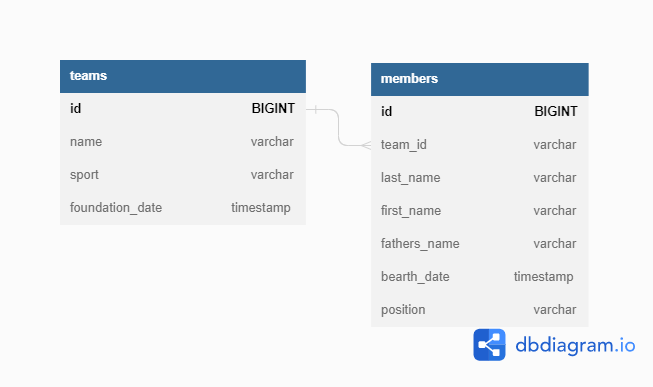

# SportTeamStorage

## Таблица MEMBERS:

1. id - PRIMARY KEY AUTO INCREMENT
2. team_id - FOREIGN KEY (TEAMS)
3. last_name
4. first_name
5. fathers_name
6. bearth_date
7. position

## Таблица TEAMS

1. id - PRIMARY KEY AUTO INCREMENT
2. name
3. sport
4. foundation_date

## Инструкция по запуску:
- клонируем проект из GitHub
- создаем БД SportTeamStorage в PgAdmin
- в application.properties указываем spring.datasource.username = имя пользователя, spring.datasource.password = пароль, spring.liquibase.user = имя пользователя, spring.liquibase.password = пароль - все из PgAdmin
- в pom.xml прописываем <liquibase.username>имя пользователя</liquibase.username> и <liquibase.password>пароль</liquibase.password> - все из PgAdmin
- запускаем проект. 

## API методы приложения:
1. POST "http://localhost:8080/teams" saveTeam() - добавляем новую команду в БД. Валидация входящего DTO.
2. GET "http://localhost:8080/teams" getAllTeams() - получаем все команды. Возможность фильтровать по видам спорта. Возможность получить команды по датам основания. Валидация границ периода поиска. На выходе сортировка данных по id команд. 
3. PATCH "http://localhost:8080/teams/{teamId}" updateTeam() - обновляем данные команды. Проверяем в методе существование команды с таким id в базе.
4. DELETE "http://localhost:8080/teams/{teamId}" removeTeam() - удаляем команду. Проверяем в методе существование команды с таким id в базе. Все игроки удаленной команды остаются в базе с team_id = null.
5. POST "http://localhost:8080/members" saveMember() - добавляем нового спортсмена в БД. Входящее DTO содержит id уже существующей в базе команды. Валидация входящего DTO.
6. GET "http://localhost:8080/members/teams/{teamId}" getAllMembersByTeamId() - получаем всех участников выбранной команды. Возможность сортировки по роли спортсмена в команде. На выходе сортировка данных по id участников.
7. GET "http://localhost:8080/members/noTeams" getAllMembersWithoutTeam() - вспомогательный метод для получения всех спортсменов оставшихся без команд после удаления команды. Возможность сортировки по роли спортсмена в команде. На выходе сортировка данных по id участников.
8. PATCH "http://localhost:8080/members/{memberId}" updateMember() - обновляем данные спортсмена. Проверяем в методе существование спортсмена с таким id в базе.
9. DELETE "http://localhost:8080/members/{memberId}" removeMember() - удаляем спортсмена. Проверяем в методе существование спортсмена с таким id в базе.
10. PATCH "http://localhost:8080/members/changeTeam/{memberId}" updateTeamOfMember() - изменяем команду спортсмена. Проверяем в методе существование спортсмена с таким id в базе.
